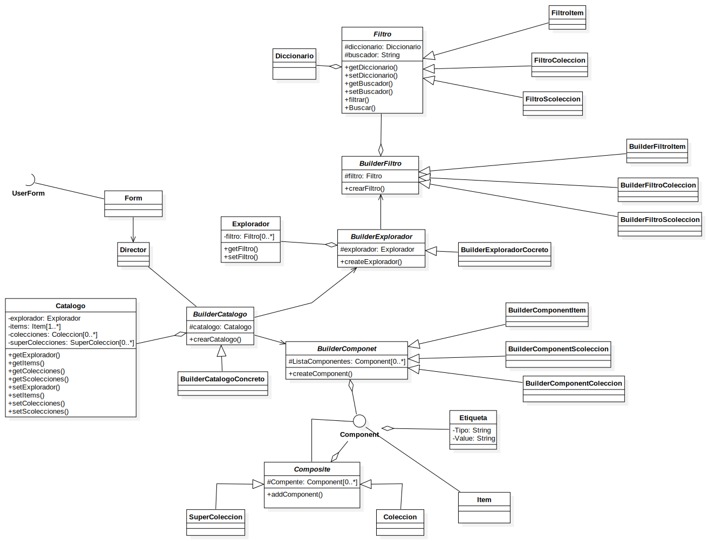

# Proyecto Generador De Catalogos

## Integrantes

* ### Jonathan Steven Cruz Monroy

* ### Kevin Andrés Forero Guaitero

* ### Santiago Andres Gordillo

* ### Johan Andres Aguirre Diaz

## Objetivo

* ### Realizar por medio de MDA la construccion de un generador de Catalogos web

## Partes del Proyecto

1) ### BuilderCatalogoWeb

    #### Es la parte del proyecto que permite la construccion del objeto catalogo mediante el llenado de un formulario por parte del usuario y realizaar la transformaacion del mismo 

    #### Esta parte del proyecto esta realizada en dart  un lenguaje desarrollado por google. Su sintaxis y estructura asemeja a java y a javascrip

    #### para su instalacion puede seguir el tutorial [aqui](https://www.youtube.com/watch?v=FweH-29eYbs&list=PLl_hIu4u7P65OQk_zAxogUjP4YJLQQT1W&index=3)

    #### La configuracion del proyecto se encuentra en el archivo **pubspec.yaml**  y corresponde a lo siguiente:

    ```yaml
    name: buildercatalogoweb
    description: A sample command-line application.
    version: 1.0.0
    # repository: https://github.com/my_org/my_repo

    environment:
    sdk: ^3.0.5

    # Add regular dependencies here.
    dependencies:
    collection: ^1.17.2
    json_annotation: ^4.8.1
    yaml: ^3.1.2
    # path: ^1.8.0

    dev_dependencies:
    build_runner: ^2.4.6
    json_serializable: ^6.7.1
    lints: ^2.0.0
    test: ^1.21.0
    ``` 

    #### de este archivo de configuracion lo mas relevante son las dependencias:
    
    * #### json_serializable
    * #### json_annotation
    * #### yaml
    
    #### Las cuales permiten el poder serializar algunas de  las clases que se  encuentran dentro del proyecto 

    #### El diagrama que representa el  modelo  general de clases que se sigue el proyecto es:
    

2) ### Generador de Codigo
   
    #### Para la generacion de codigo se hace uso de la herramienta yeoman
